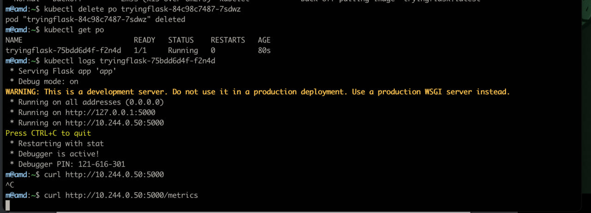
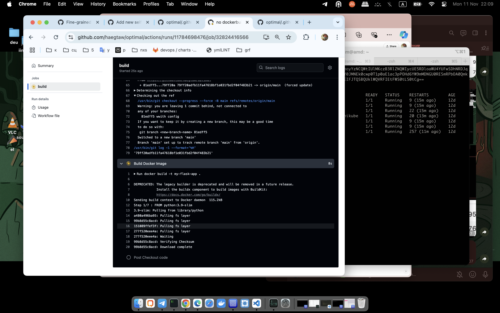

Итак. Я начала работу над тестовым заданием в воскресенье, и, так как было бы преступлением использовать гитлаб и раннеры моей текущей компании, а собстенного сервака у меня по сумме событий пока нет, то я развернула гитлаб и гитлаб-раннер на локальной машинке с убунту 22.
Гитлаб я подняла и пайпы со сборкой и тестом успешно прокатила (только из-за специфики вм на локальной машинке, это было очень, очень, очень медленно)
Запоролась на том, чтобы раннер нашел по ссш мою вм-ку с миникубом (что он прекрасно делал по ссш руками, но не в пайпе, подложить ключ в виде переменной мой чудовищно медленный гитлаб на локалке так и не дал, в виде переменной тоже приватный ключ выкладывать было бы нехорошо)

Если образ, собранный пайпом, перекинуть tar по scp на машинку с миникубом, там собрать обратно в докер-образ и дать разрешение миникубу использовать небезопасные реджистри, то руками в миникубе задеплоить аппку можно

Требуемые в тестовом под, деплоймент и метрики

Но это не то, что нужно, ведь деплоить тоже должен пайп, а не девопс.
Таким образом, в воскресенье мной был приобретен чрезвычайно интересный и воспитывающий долготерпение опыт локально развернутого гитлаба при помощи snap. Конечно, я сделала в пн ещё одну попытку, но уже в докер-композе

Это оказалось ещё медленнее, почти невыносимо. Пришло время все-таки отправиться на настоящий gitlab.com

Но на гитлабе граждан РФ сейчас не принимают, поэтому я обратилась к гитхаб actions. Сиайки там пишутся специфически, иначе, чем на гитлабе, но принципиально разница невелика.

Тут мой код по проекту
https://github.com/haegtaw/optimal/tree/main
Вот успешный пайп
https://github.com/haegtaw/optimal/actions/runs/11786069696

С пайплайном пришлось повозиться, потому что не сразу догадалась подсунуть кубконфиг и работать кубектлом сразу с машины с раннером

Метрики от задеплоенной аппки

Очень полезное задание, хотя на продовых мощностях деплоить на порядок проще :)